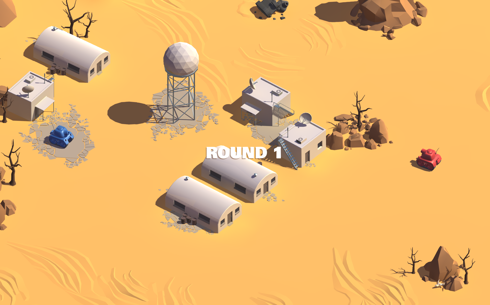
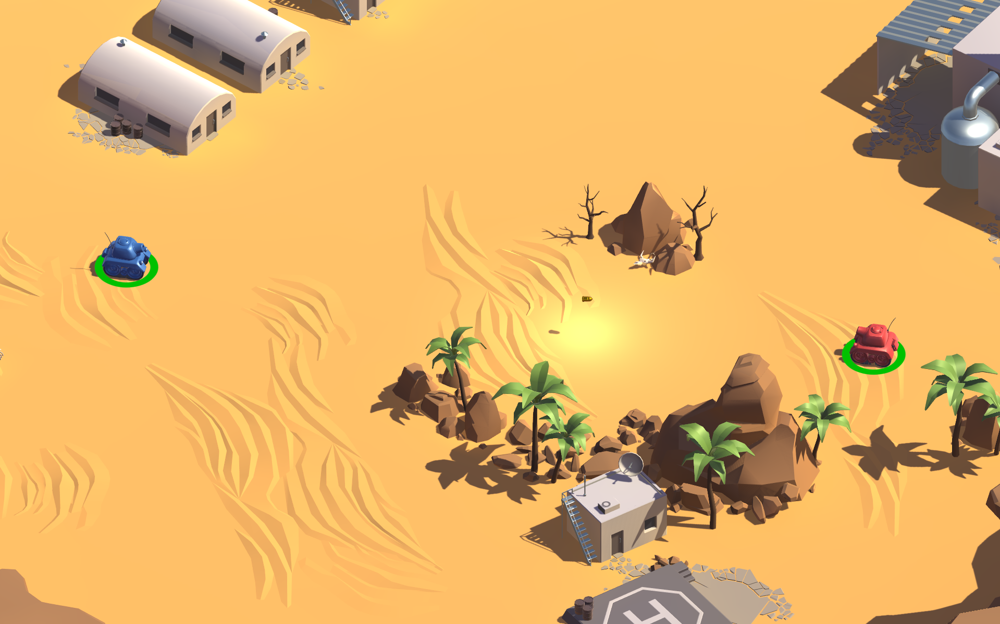
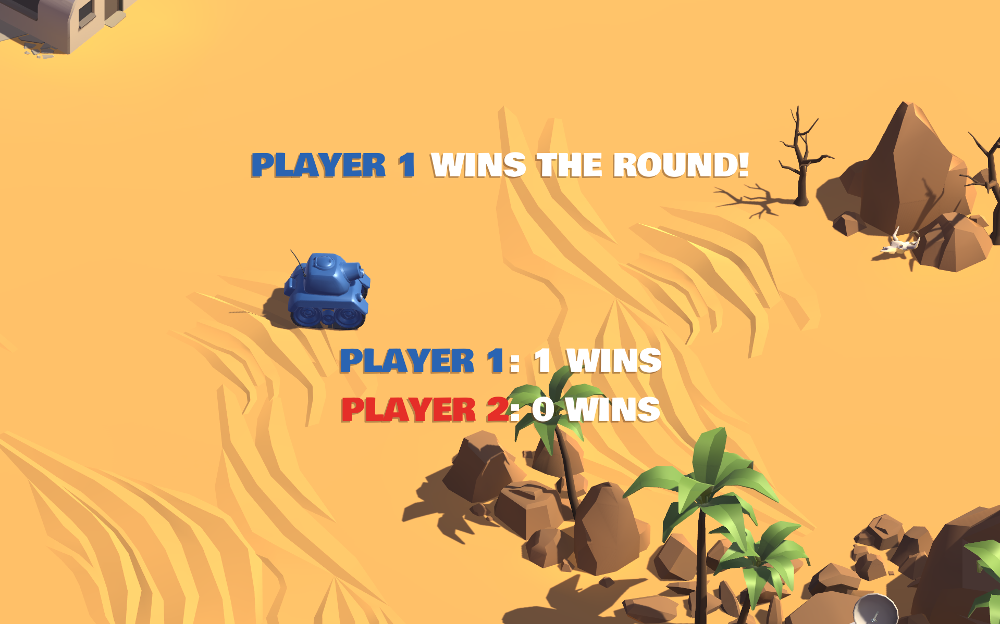
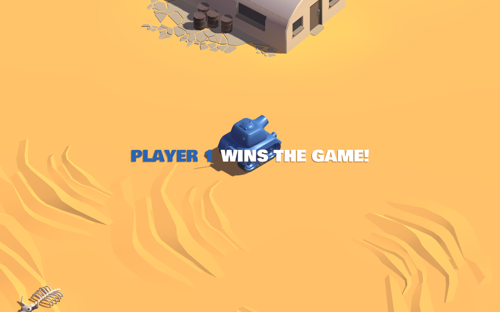

## A fun 2-player local multiplayer game made in Unity.

This is a small prototype of a game I made a couple of years back, features 2 tanks that shoot at each other. The game runs over multiple rounds for a win.

The game has a few neat tricks, a few of them being:
- Splash Damage!
- Bullets are actual objects with rigidbodies, so they can hit each other!
### Controls:
##### Player 1:
- WASD to move
- Spacebar to shoot
##### Player 2:
- Arrow keys to move
- Enter/Return key to shoot
### Screenshots:

